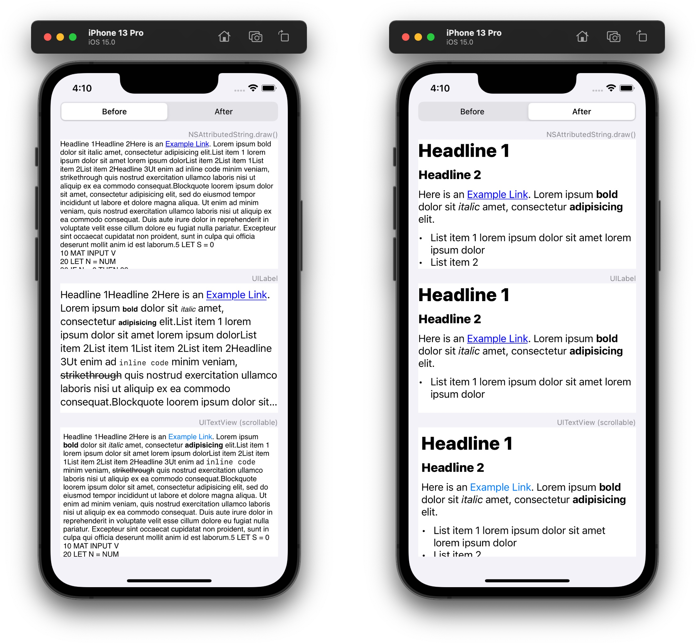
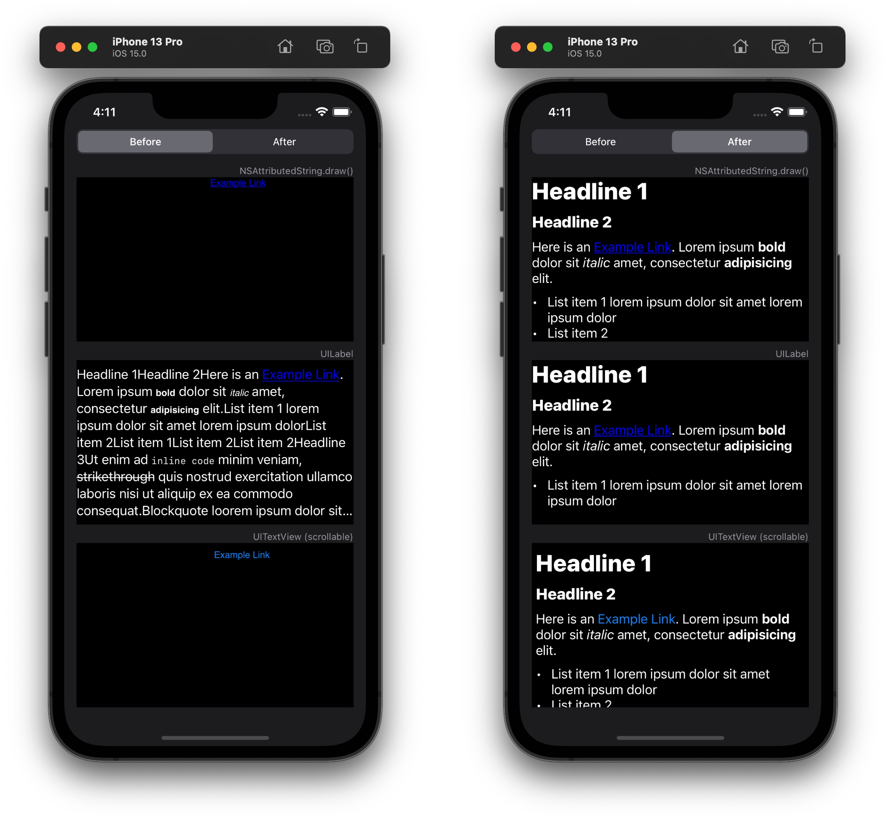

# AttributedString Markdown initializer with custom styling

[`AttributedString`](https://developer.apple.com/documentation/foundation/attributedstring) in iOS 15 and macOS 12 comes with a [Markdown initializer](https://developer.apple.com/documentation/foundation/attributedstring/3796160-init).

----

But:

- There is no styling (not even bold or italic) when [drawing](https://developer.apple.com/documentation/foundation/nsattributedstring/1524971-draw) the `AttributedString` in a custom view.
- The `AttributedString` does have some styling applied when it’s assigned to a `UILabel` or to a `UITextView`, but they are noticeably different and weird things happen with the font sizes.
- All line breaks that should separate the content blocks are missing.
- The `AttributedString` colors don’t react to toggling between dark and light mode.

## What’s going on?

There is not a lot of information about Markdown in `AttributedString` out there yet, but I think I was just [holding it wrong](https://www.urbandictionary.com/define.php?term=You%27re%20Holding%20It%20Wrong):

The Markdown initializer merely adds *semantic* (not visual) markup to the `AttributedString`. Both `UILabel` and `UITextView` interpret these to a certain extent, while drawing a raw `(NS)AttributedString` doesn’t.

The Markdown initializer merely puts the Markdown parsing results as [*Presentation Intents*](https://developer.apple.com/documentation/foundation/nspresentationintent) into the `AttributedString` runs.
- There are `inlinePresentationIntent`s, e.g. `.stronglyEmphasized` for bold text.
- There are `presentationIntent`s for blocks like headlines (like `.header(1)` for a `H1`).

## This sample project

This sample project shows how you can find these intents and replace them with actual `AttributedString` styling information like font weights and foreground colors.

I don’t know if there’s a more elegant way to solve this.
Do let me know if you have a better solution!

----

© 2021 [Frank Rausch](https://twitter.com/frankrausch)
